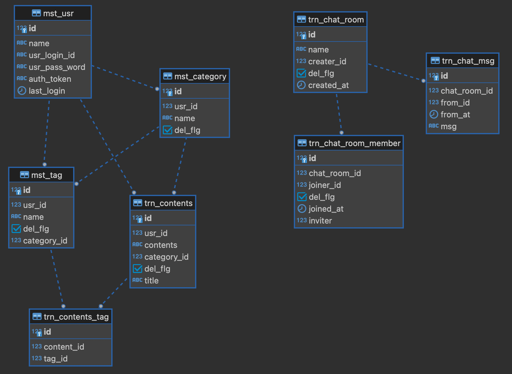

# Golang + Gin + GORM + PostgreSQL + melody(websocket)

## initiate
```sh
go mod init test_crud
```

## libs
```sh
go install github.com/gin-gonic/gin@latest
go get github.com/gin-contrib/cors
go get github.com/lib/pq
go get github.com/jinzhu/gorm
go get github.com/olahol/melody
```

## run
```sh
# run (for degub)
go run .

# build
go build
# run detach
nohup ./test_crud &

# checkport
lsof -P -i:8181
kill {PID}
```

## [Tool] create struct from ddl
https://qiita.com/neras_1215/items/f5b6e29c9fb870f1b4e3#go

# [OverView] package structure

## package:model
- db entity / dto struct
- api request struct
- api response struct

## package:service
api implementation

## package:sql
query, ddl, connection-setting

# [OverView]Design
## IFs
- usr create/read/update/delete
- category create/read/update/delete
- tag create/read/update/delete
- contents create/read/update/delete
- chatroom create/read/update/delete
- chatmsg create+broadcast/read
- wheather get

## tables
detail in ddl.sql


